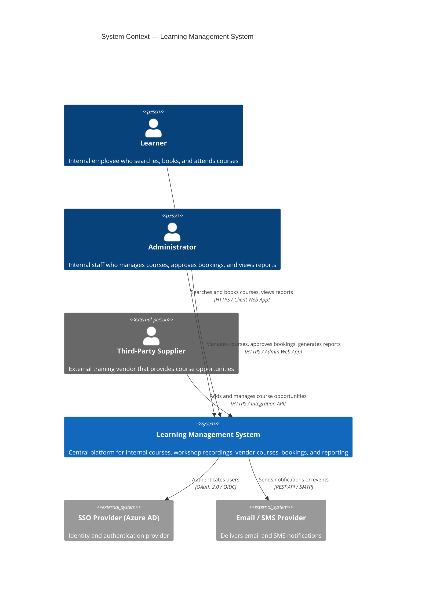

# View 1 — System Context (C4 Level 1)

## View Brief

This view shows the **Learning Management System (LMS)** as a single black box in the centre of its environment. It answers: *who are the people and external systems that interact with the LMS, and through what channel?*

It establishes the **system boundary** and names every actor that crosses it. Internal behaviour (services, databases, workflows) is deliberately hidden — that detail belongs to Views 2 (Component Map) and 3 (Course Booking Workflow).

- **Scope:** the LMS as delivered to the service company.
- **Primary human actors:** Learners, Administrators, Third-Party Suppliers.
- **Key external system dependencies:** Azure AD (SSO) and the Email/SMS Provider.

---

## Legend (C4 Level 1 Notation)

| Shape / Colour              | Element Type           | Meaning                                                    |
| --------------------------- | ---------------------- | ---------------------------------------------------------- |
| 🔵 Blue rounded figure      | **Person**             | Internal human user (inside the organisation)              |
| ⚫ Grey rounded figure       | **Person (External)**  | Human user outside the organisation                        |
| 🟦 Dark-blue rectangle      | **System (In Scope)**  | The LMS itself — the system being designed                 |
| ⬛ Grey rectangle            | **System (External)**  | Existing external system the LMS depends on                |
| → Solid arrow + label       | **Interaction**        | Direction of call / data flow with protocol and purpose    |

**Reading the diagram:** each arrow is labelled with *what happens* + *[protocol / channel]*. Arrows always point from the initiator to the target. External dependencies sit outside the central system box.

---

## Diagram

---

## Notation Notes

- `Person(...)` — internal human actor (blue).
- `Person_Ext(...)` — external human actor (grey).
- `System(...)` — the system in scope (dark blue).
- `System_Ext(...)` — external system dependency (grey).
- `Rel(from, to, "label", "technology")` — a directed relationship; the second string is the **technology / protocol** that appears under the label in the rendered diagram.

This follows Simon Brown's C4 model (see *c4model.com*), Level 1 — System Context.
